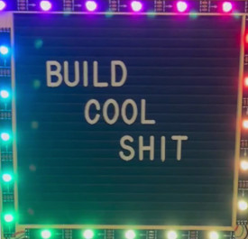

# buildcoolshit: Lightweight WS2812B LED driver for use with letter boards and tinyAVRs

This is a program for tinyAVRs that targets the ubiquitous letter boards you can get on Amazon or
at your local dollar store, and the LED tape you can get easily off eBay/Aliexpress/etc.

This program is heavily optimized for size and memory usage. When all functions are enabled, the program
easily fits on an ATTiny45. With other functions turned off and less LEDs to drive, it's trivial to fit
single-effect builds on the ATTiny25.

As this program uses BSD-licensed code from the [avr-ws2812 project](https://github.com/stephendpmurphy/avr-ws2812), I have to make my modifications
open source.

# Bill of materials

* AVR with at least 4k program space and 256 bytes RAM
* Letter board (this targets 6x6 or 12x12 letter boards)
* WS2812B LED tape
* Something to hold it all together and power it

# Supported ATTinys

* ATTinyX5, primarily targeting ATTiny45s
* ATTinyX02, primarily targeting ATTiny402s

# License

BSD 3-clause